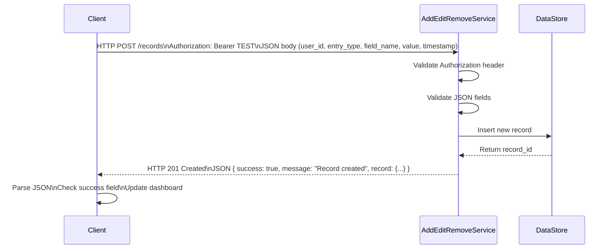
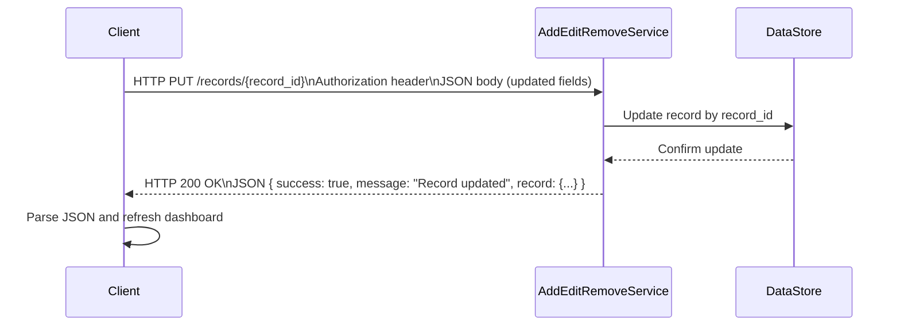
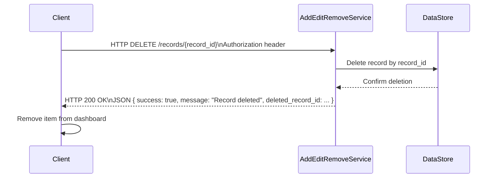

# Microservice 4 – Add / Edit / Remove Personal Information and Activity

## Description

This microservice provides a REST API that allows other programs to:

- Add new personal information or activity records  
- Edit existing records  
- Delete existing records  

It is responsible only for modifying records in the system.

All communication occurs over HTTP using JSON.

Base URL (local development):

```
http://localhost:5004
```

---

# Communication Contract

All endpoints require the following header:

```
Authorization: Bearer <token>
```

All requests and responses use:

```
Content-Type: application/json
```

---


# Endpoint 1 – ADD Record

## Request

```
POST /records
```

## Required JSON Body

```json
{
  "user_id": "u999",
  "entry_type": "activity",
  "field_name": "steps",
  "value": 8500,
  "timestamp": "2026-02-16T17:00:00-08:00"
}
```

## Successful Response (201 Created)

```json
{
  "success": true,
  "message": "Record created",
  "record": {
    "record_id": "abc123",
    "user_id": "u999",
    "entry_type": "activity",
    "field_name": "steps",
    "value": 8500,
    "timestamp": "2026-02-16T17:00:00-08:00"
  }
}
```

---

# Endpoint 2 – EDIT Record

## Request

```
PUT /records/{record_id}
```

## Required JSON Body

```json
{
  "value": 9200
}
```

## Successful Response (200 OK)

```json
{
  "success": true,
  "message": "Record updated",
  "record": {
    "record_id": "abc123",
    "value": 9200
  }
}
```

---

# Endpoint 3 – DELETE Record

## Request

```
DELETE /records/{record_id}
```

## Successful Response (200 OK)

```json
{
  "success": true,
  "message": "Record deleted",
  "deleted_record_id": "abc123"
}
```

---

# How to Programmatically REQUEST Data

## Using curl (Terminal Example)

### ADD

```bash
curl -X POST "http://localhost:5004/records" \
  -H "Authorization: Bearer TEST" \
  -H "Content-Type: application/json" \
  -d '{
        "user_id":"u999",
        "entry_type":"activity",
        "field_name":"steps",
        "value":8500,
        "timestamp":"2026-02-16T17:00:00-08:00"
      }'
```

### EDIT

```bash
curl -X PUT "http://localhost:5004/records/abc123" \
  -H "Authorization: Bearer TEST" \
  -H "Content-Type: application/json" \
  -d '{"value":9200}'
```

### DELETE

```bash
curl -X DELETE "http://localhost:5004/records/abc123" \
  -H "Authorization: Bearer TEST"
```

---

## Using Python (requests library)

```python
import requests

url = "http://localhost:5004/records"
headers = {"Authorization": "Bearer TEST"}

payload = {
    "user_id": "u999",
    "entry_type": "activity",
    "field_name": "steps",
    "value": 8500,
    "timestamp": "2026-02-16T17:00:00-08:00"
}

response = requests.post(url, json=payload, headers=headers)
print(response.status_code)
print(response.json())
```

---

# How to Programmatically RECEIVE Data

All responses are returned as JSON.

To receive and use the response:

1. Check the HTTP status code.
2. Parse the JSON.
3. Use the `record` or `deleted_record_id` field.

## Example (Python)

```python
response = requests.post(url, json=payload, headers=headers)

if response.status_code in (200, 201):
    data = response.json()
    if data["success"]:
        print("Success:", data["message"])
        record = data.get("record")
        print("Record returned:", record)
    else:
        print("Failure:", data["message"])
else:
    print("HTTP Error:", response.status_code)
```

---

# UML Sequence Diagram – ADD Flow



---

# UML Sequence Diagram – EDIT Flow



---

# UML Sequence Diagram – DELETE Flow


